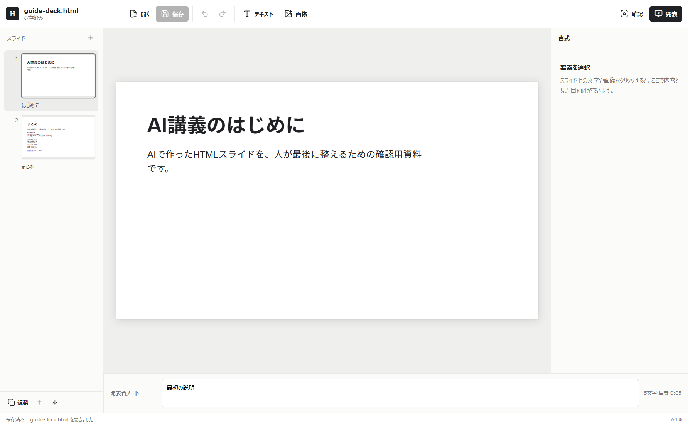

# HTML Slide Studio

AIで作った静的HTMLスライドを、Windows上で最後に直し、そのまま発表するためのローカルファーストなデスクトップアプリです。

> A local-first Windows desktop app for polishing AI-generated static HTML slides and presenting them.



## こんな人のためのツールです

- AIとの壁打ちからHTMLスライドを作ったが、発表直前の文言や配置を手元で直したい
- HTMLやCSSを直接編集せず、スライド一覧を見ながら内容を整えたい
- PowerPointへ変換せず、元のHTMLをそのまま保存・発表したい
- クラウドへ資料をアップロードせず、ローカルだけで作業したい

汎用プレゼンテーションソフトの代替ではありません。対象を「既にある静的HTMLスライドの仕上げと発表」に絞っています。

## できること

- HTMLをファイル選択、ドラッグ＆ドロップ、実行時引数から開く
- 同梱デモの編集用コピーを起動トップページから開く
- 既存の文字、基本書式、位置、サイズを修正する
- 文字や画像を追加し、画像を差し替える
- スライドを追加、複製、上下へ並べ替える
- Undo／Redo、発表者ノート、発表前チェックを使う
- 1画面では全画面表示、複数画面では投映画面と発表者画面を分ける
- 発表中に、数秒で消えるレーザーと消すまで残るペンを使う
- 開いたHTMLへ安全に上書き保存する

## まず試す

1. [Releases](https://github.com/fukamin-lab/html-slide-studio/releases)から `HTML Slide Studio.exe` をダウンロードします。
2. EXEを任意のフォルダへ置き、実行します。インストールは不要です。
3. 起動トップページの `デモを開く` を選びます。
4. 文字の変更、スライドの複製、ノート、保存、発表を順に試します。

同梱デモはアプリのデータ領域へ作る編集用コピーです。自由に上書きしても、EXE内の原本は変わりません。

> [!WARNING]
> v0.1.0は **Windows ARM64専用** です。Snapdragon搭載Windows PCを対象にしています。コード署名をしていないため、初回起動時にWindowsの警告が表示される場合があります。警告を回避する目的でセキュリティ機能を無効化しないでください。配布元とSHA-256を確認してから実行してください。

詳しい操作は[スクリーンショット付きユーザーガイド](docs/user-guide/index.html)を参照してください。

## 保存と画像の扱い

保存は、開いたHTMLと同じファイルへの上書きです。元版も残したい場合は、アプリで開く前にHTML一式をコピーしてください。

保存中は外部アプリによる同時変更を検出し、別の変更を黙って上書きしません。中断した保存を復旧した場合や、外部変更を守るためバックアップを残した場合は画面に通知します。

追加画像はHTMLへ埋め込まず、HTMLと同じ場所の `<ファイル名>.assets/` にコピーします。HTML本体の肥大化を避け、資料一式をフォルダ単位で扱えます。未参照画像の自動整理は、アプリの所有索引と実ファイルのhashが一致する画像だけを対象にし、外部で変更された画像や利用者が置いたファイルは残します。

## 対応するHTML

ローカルで完結する静的HTMLを対象にしています。

- Reveal互換の `.reveal .slides > section`
- 兄弟関係にある `section.slide`、`article.slide`、`[data-slide]`
- `body` 直下の `section` または `article`
  - プレビューと内容編集のみ対応
  - スライドか汎用sectionか安全に判定できないため、追加・複製・並べ替えは無効

安全のため、プレビューと発表では入力HTML内のスクリプトを実行しません。

### 対応しないもの

- JavaScriptの実行を前提にした動的スライド
- クラウド同期、認証、共同編集、変更履歴
- PowerPoint／PDFへの変換
- x64／x86版Windows、macOS、Linux向けの配布物

## 基本操作

1. `開く` でHTMLを選びます。
2. 左の一覧でスライドを選びます。
3. スライド上の文字や画像を選び、右側で修正します。
4. 必要なら `テキスト`、`画像`、左上の `＋`、`複製`、上下矢印を使います。
5. 下部に発表者ノートを書き、`確認` で問題を確認します。
6. `保存` で同じHTMLへ上書きします。
7. `発表` で発表モードに入ります。

### ショートカット

- `Ctrl+O`: 開く
- `Ctrl+S`: 保存
- `Ctrl+Z`: 元に戻す
- `Ctrl+Y` または `Ctrl+Shift+Z`: やり直す
- 矢印キー: 選択中の要素を移動
- `Delete`: 選択中の要素を削除
- 発表中の `←` / `→`、`PageUp` / `PageDown`、Space: スライド移動
- 発表中の `Esc`: 編集画面へ戻る

## ローカルで開発する

必要なものはNode.js 22.12.0以降とWindowsです。

```powershell
git clone https://github.com/fukamin-lab/html-slide-studio.git
cd html-slide-studio
npm ci
npm run dev
```

公開版では開発サーバーに `127.0.0.1:5173` を使います。競合する場合は、公開版に限り次のように変更できます。

```powershell
$env:HSS_DEV_PORT = "5174"
npm run dev
```

### 検証

```powershell
npm run public:source:check
npm run guide:check
npm run verify
```

公開cloneでは`public:source:check`がorigin、clean状態、ignored/untracked file不在、公開境界をまとめて検査します。内部正本ではallowlist snapshotを新しい一時directoryへ作り、内部識別子不在を独立に検査して、後続gateを実行する候補pathを表示します。

`npm run verify` は単体テスト、型検査、実Electronを操作するE2Eを実行します。デモopen、スライド操作、ノート、文字追加、上書き保存、再起動後の復元、発表者画面、対応外構造での安全な機能制限を確認します。

### Windows ARM64版を作る

```powershell
npm run package:win
npm run verify:package
```

成果物は `release/` に出力されます。パッケージ検証ではportable EXEをremote debuggingなしで実際に起動し、製品名、ARM64 PE、同梱デモ、未保存確認、正常終了、およびsecurityを弱める起動optionの拒否を確認します。公開やコード署名は行いません。

リリース担当者向けの再現手順は[docs/RELEASE.md](docs/RELEASE.md)にあります。

## プライバシーとセキュリティ

- 資料はローカルファイルとして処理します。
- テレメトリ、アカウント、クラウド保存はありません。
- 入力HTMLのスクリプトはプレビューと発表で実行しません。
- セキュリティ上の問題は公開Issueへ詳細を書かず、[SECURITY.md](SECURITY.md)の手順で報告してください。

## コントリビューション

不具合報告や、小さく焦点の合った改善提案を歓迎します。先に[CONTRIBUTING.md](CONTRIBUTING.md)と[SUPPORT.md](SUPPORT.md)を確認してください。このツールの焦点から外れる大規模な汎用化は、採用しない場合があります。

製品の保存・資産・画面・発表に関する契約は[docs/PRODUCT_CONTRACT.md](docs/PRODUCT_CONTRACT.md)にあります。

## ライセンス

ソースコード、同梱デモ、アプリアイコン、ユーザーガイドは、特記がない限り[MIT License](LICENSE)で提供します。第三者ライブラリの表示は[THIRD_PARTY_NOTICES.md](THIRD_PARTY_NOTICES.md)を参照してください。
